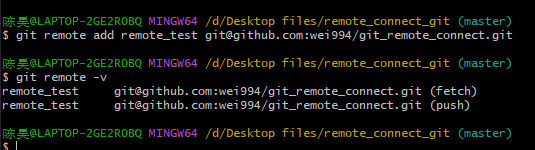
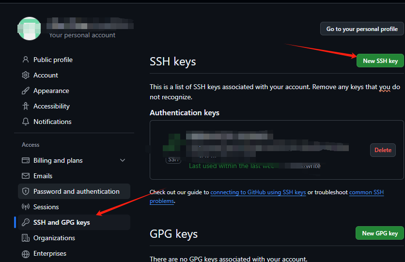
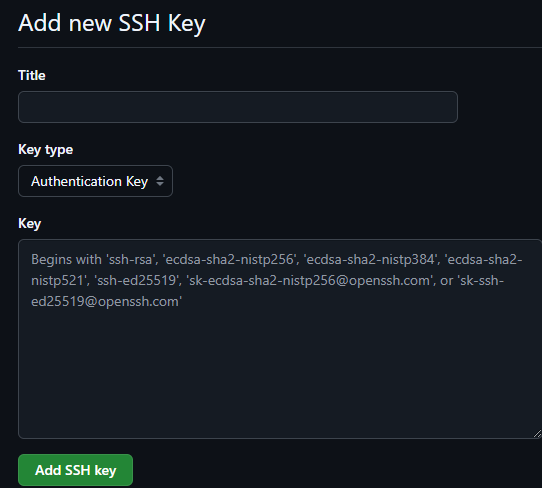

#  Git 连接远程仓库
使用ssh 密匙连接远程仓库流程 

Github 支持两种同步方式“htttps”和“ssh" 

使用 https 不需要配置就可以使用，但是每次提交代码和下载代码都需要输入用户名和密码

使用 ssh 需要在本地生成密钥对，公钥和密钥，把公钥放到GitHub服务器上就可以使用

## 前提：已安装git,已创建Github账户


## Github 创建新的远程仓库


命名

## 生成ssh密匙

1.选择需要上传的文件夹， 进入 git bash





```python
git config --global user.name "XXX" 设置#用户名标识 也可以天GitHub仓库名

git config --global user.email "xxxx@XXX.com" #设置邮箱标识 可以填写登录GitHub 的邮箱

git config user.name #查看用户名

git config user.email $查看用户邮箱
```

注意 git config --global  #这台电脑上所有Git仓库都会使用这个配置，也可以对某个仓库指定不同的用户名和邮箱


 创建SSH Key 

 1.首先在 C:\Users\用户名 或 C:\Users\Administrator 查看有不有 .ssh 目录

 再查看改目录是否有id_rsa 和 id_rsa.pub 两个文件 如果有这两个文件可以跳过 创建SHH 密钥 过程。

 每次创建ssh
 都会覆盖掉之前的ssh密匙


```python
ssh-keygen -t rsa #创建密钥
#然后两次回车 
```


密钥会默认放在C:\Users\用户名\.ssh 或 C:\Users\Administrator\.ssh中 


.pub 文件中就是公钥，记事本打开复制即可


## 远程Github 配置 ssh 密钥

密钥生成后，在GitHub设置中配置密钥本地就可以顺利访问


点击后 title 可填以不，然后将复制的公钥粘贴




## 连接指定仓库


```python
git remote #查看是否有远程仓库
```


该文件夹没有git init 它不是仓库文件夹


之后输入 git remote 

如果没有任何显示，表示未连接到远程仓库

连接远程仓库


```python
git remote add remote_test git@github.com:wei994/git_remote_conect.git

# 命令行格式 git remote add 远程库命名 git@github.com:用户名/仓库名。git
# 之后的操作中可以用 remote_test 代替 git@github.com:wei994/git_remote_conect.git 这个仓库

```


添加后可查看远程仓库 


```python
git remote -v #查看远程仓库
```

## 本地仓库上传远程仓库

以上操作后本地仓库就已经连上远程仓库了，接下来就需要把本地仓库文件上传到远程仓库


```python
git add . #注意“.” 符号，追踪仓库目录下所有修改文件并添加到暂存

git commit -m "注释" # 添加修改到仓库 如果未添加 -m 注释会进入编辑器模式 添加注释后 Esc退出输入模式进入命令行模式，命令模式下键入ZZ或者:wq保存修改并且退出 

git status # 查看文件状态

git push remote_test master # 格式 git push 仓库名 master 推送当前分支master推送到远程到远程仓库

git push -u remote_test master #由于远程库是空的，我们第一次推送master分支时，加上 –u参数，Git不但会把本地的master分支内容推送的远程新的master分支，还会把本地的master分支和远程的master分支关联起来

git push remote_test master # 只要本地commit 了 就可以将master分支的最新修改推送到远程


```

## 本地仓库同步远程仓库


```python
git pull remote_test master
```

## 参考
[Git连接github仓库](https://www.cnblogs.com/hdlan/p/14395681.html)
